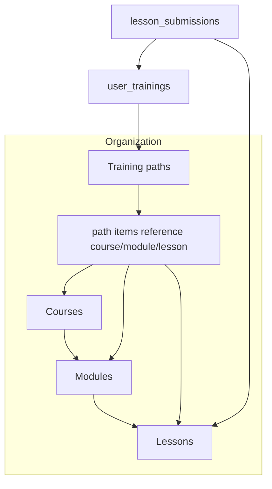

# Hangar domain concepts

This document explains how roles, organizations, catalog content (courses, modules, lessons), training paths, visibility, enrollment, and progress tracking fit together. It reflects the intended model in the codebase and database as of April 2026.

---

## User roles

The product distinguishes **two role systems**:

### Platform (system) roles — `public.users.role`

Stored on each user row. Used for platform-admin access (`admin` / `god`), account lifecycle (`guest`), and default authenticated tier (`standard`). **Mentor/manager/supervisor capability is not encoded here** — it lives on organization memberships.

| Role | Typical use |
|------|-------------|
| `guest` | Limited / pre-org flows; explicit signup metadata only. |
| `standard` | Normal authenticated user (default). Trainee vs mentor UI comes from **active organization** membership. |
| `admin` | Platform administrator (combined with **`platform_elevation`** when set). |
| `god` | Full platform superuser |

Helpers and ordering: [`lib/auth-shared.ts`](../lib/auth-shared.ts). Middleware and nav use **`standard` + active org** for dashboard routing; see migration `045_system_standard_org_supervisor.sql`.

### Organization roles — `public.user_organizations.role`

Each **membership row** assigns a role *within one organization*: `student`, `mentor`, `manager`, or `supervisor` (organization tenant admin). Users can belong to **zero or more** organizations; each membership has its own role.

The app remembers **`last_active_organization_id`** and an HTTP cookie (`hangar_active_organization_id`) so the shell reflects the user’s role **in that org** when they have multiple memberships.

### Platform elevation

`users.platform_elevation` pins `admin` or `god` so **`users.role` stays elevated** regardless of org membership changes. Recomputation for non-elevated users sets `standard`; see `045_system_standard_org_supervisor.sql` (supersedes org-max mirroring from earlier migrations).

---

## Organizations

Organizations are the **tenant-style boundary** for catalog ownership:

- **`organizations`**: named tenant; optional `lead_user_id` primary contact.
- **`user_organizations`**: `(user_id, organization_id)` with an org role.

Cross-org **platform** administration (creating organizations, editing any membership, global god tools) is limited to **`auth_is_platform_admin()`** (`users.role` is `admin` or `god`). See migration `047_org_scoped_supervisor_rls.sql`.

**Organization supervisors** (`user_organizations.role = supervisor`) manage **one tenant** via the **Organization** app section and RLS scoped by `organization_id`:

- View/update memberships **only for organizations where they are supervisor** (cannot assign another supervisor without platform admin).
- View/update **organization_training_entitlements** and related billing-ish rows **only when tied to their organization’s paths**.
- Organization **`manager`** still gets Training Manager authoring tools and can **see** co-members and subscriptions for assignments; destructive membership changes remain supervisor-only (plus platform admin).

Helper functions include **`auth_is_org_supervisor(uuid)`**, **`auth_is_org_manager_or_supervisor(uuid)`**, and the backwards-compatible alias **`auth_has_manager_or_god_in_any_org`** → **`auth_can_manage_orgs_and_memberships()`** (platform-admin-only since `047`).

Each **`courses`** row and each **`training_paths`** row belongs to **exactly one** `organization_id`. Comments in `028_organizations.sql` describe organizations as grouping catalog ownership.

**Seat / license tracking** uses `organization_training_entitlements` keyed by organization and training path (legacy course keyed rows were migrated away in enrollment work).

---

## Content structure: courses, modules, lessons

The **authoritative content hierarchy** is:

```text
Course
  └── Module (many per course, ordered by `number` / sort)
        └── Lesson (many per module; may reference ATA metadata, planned hours, etc.)
```

Important properties:

- **Courses** live in exactly one organization and carry `visibility` (`catalog_visibility`) for the **manager/author lifecycle** (draft vs review vs usable-in-path vs cross-org nuances). See [`lib/catalog-visibility.ts`](../lib/catalog-visibility.ts) for human-readable descriptions of course vs path wording.
- **Modules** can be hidden from end users via flags such as `is_hidden_from_users` (authoring ergonomics).

There is **no enrollment directly on courses** in the current model—see below.

---

## Training paths: the assignment and enrollment layer

### What a training path is

**`training_paths`** are managerial groupings layered on top of catalog content. Metadata includes name, organization, totals, `visibility`, `monetization`, `is_active`, optional **`talent_lms_course_id`** (numeric Talent LMS course id for REST enrollment after Hangar checkout when `TALENTLMS_API_KEY` is configured), etc.

**`training_path_items`** glue a path to **exactly one** of:

- a **whole course**, or  
- a **single module**, or  
- a **single lesson**.

Items are processed in **`sort_order`**. Expansion to a flat lesson list (with duplicate lesson IDs skipped) is done in [`lib/training-lessons.ts`](../lib/training-lessons) (`fetchLessonsForTrainingPath`).

Enrollments always reference a **`training_path_id`** (`user_trainings`; see migrations `040_enrollment_paths_only.sql` and `041_drop_enrollment_source_course_singleton.sql`). **Courses hold content**; **paths define the program shape and are the enrollment surface**. There is no automatic “one wrapper path per course” or trigger creating paths on course insert—that pattern was removed in `041_drop_enrollment_source_course_singleton.sql`.

---

## Visibility: training paths vs courses

Both entities reuse the enum **`catalog_visibility`**: `draft`, `unreleased`, `proprietary`, `public`. **Meaning differs** by entity (see migration `042_catalog_visibility_and_monetization.sql` comments).

### Training paths (student / marketplace discovery)

Rough intent:

| Value | Audience |
|--------|-----------|
| `draft` | Author + platform admin (creator constraint in RLS). |
| `unreleased` | Org **managers/admins**, not mentors/students as general discovery. |
| `proprietary` | Must be **in** the owning organization (`user_organizations`). |
| `public` | Any authenticated user can see listing subject to queries. |

The database helper **`auth_can_view_training_path`** (in `044_rls_catalog_visibility.sql`) encodes this. **`training_path_items`** are readable when the parent path satisfies visibility rules **or** the user has an enrollment row for that path.

### Courses (builder / manager lifecycle)

Course visibility gates **who can author, preview, reuse in paths, pick in path builders**. Students are not meant to browse raw courses independently—they reach material **through a path they enrolled in**. RLS uses helpers like **`auth_course_reachable_via_enrollment`**: seeing course rows through the client depends on owning an enrollment whose path covers that course/module/lesson subtree.

Short mental model:

- **Paths** answer “Which programs exist and who can discover or enroll?”  
- **Courses** answer “How is reusable content gated while we build paths?”

---

## Enrollment and grants

Enrollment is stored as **`user_trainings`**, with **`training_path_id` required** (`040_enrollment_paths_only.sql`; singleton course-wrapper paths were dropped in `041_drop_enrollment_source_course_singleton.sql`). Earlier “enroll directly in a course” behavior was removed—paths always sit in between.

Flows include manager assignment and trainee self-service **Find Training** [`app/dashboard/student/find-training/page.tsx`](../app/dashboard/student/find-training/page.tsx):

- Queries only **discoverable** paths: **`visibility = public`** or **`proprietary`** when the trainee’s **`user_organizations`** includes the **path’s organization** (see [`lib/discoverable-training-paths.ts`](../lib/discoverable-training-paths.ts)).
- **Self-enrollment** additionally checks **`userMaySelfEnrollFromVisibility`** inside [`purchaseTrainingPlan`](../app/actions/purchase-training.ts): `draft` / `unreleased` paths cannot be checked out casually by students.
- Enrollment creation also involves **`user_training_access_grants`** (and related seat metadata as implemented) so “checkout” establishes access even when the path is nominally **free**.

`training_path_assignments` existed in an older assignment model and was dropped when catalog redesign landed (`013_training_paths_catalog_and_lesson_submissions.sql`).

---

## How progress is tracked (current behavior)

Tracking splits into **lesson-level program progress**, **aggregated hour accounting**, **logbooks**, and **mentorship visibility**.

### Lesson completions (program checklist)

[`lib/training-progress.ts`](../lib/training-progress.ts) documents:

- **Completed lesson** \(\approx\) **`lesson_submissions`** row with **`submitted_at` set** for that **`user_training_id`** and **`lesson_id`**.
- **Program percent by hours**: compares **`user_trainings.hours_completed`** (maintained when submissions finalize) against **`training_paths.total_hours`**.
- Lesson lists shown to students and mentors come from **`fetchLessonsForEnrollment`**, driven by **`training_path_items`** expansion—not by viewing the raw course tree outside the enrollment.

### Mentors and mentorship

Each **`user_trainings`** row can reference **`mentor_id`**. Mentors typically list trainees with `.eq("mentor_id", userId)`. Pages under `app/dashboard/mentor/` reuse **`getEnrollmentLessonSnapshot`** alongside **logbook** stats so dashboards show both structured lesson progress and time-on-job.

### Logbook vs lessons

**`logbook_entries`** track hours/work entries with statuses (submission/approval workflows). Mentor views compare totals to **expected pace** vs a long-term hour target—this is parallel to structured lesson throughput and answers “are they accumulating experience hours appropriately?” vs “did they submit lesson N?”

### Student “focus” enrollment

[`getCurrentUserTrainingContext`](../lib/current-user-training.ts) resolves the trainee’s focused enrollment via **`users.current_user_training_id`**—the **`user_trainings.id`** actively used for dashboard, logbook, and progress scopes when multiple enrollments exist.

### ACS / certifications

Certification targets can live on **`users.current_certification`** per the same helper; ATA chapter overlays join logbook aggregation in [`app/actions/progress.ts`](../app/actions/progress.ts)-style flows.

---

## Quick reference diagram



---

## Where to read further

| Topic | Starting point |
|--------|----------------|
| Visibility RLS definitions | `supabase/migrations/044_rls_catalog_visibility.sql` |
| Catalog visibility enums & UX copy | `supabase/migrations/042_catalog_visibility_and_monetization.sql`, [`lib/catalog-visibility.ts`](../lib/catalog-visibility.ts) |
| Enrollment on training paths only | `supabase/migrations/040_enrollment_paths_only.sql`, `041_drop_enrollment_source_course_singleton.sql` |
| Roles split / platform elevation | `031_system_vs_organization_roles.sql`, `039_platform_elevation_sync_system_role.sql` |
| Lesson progress math | [`lib/training-progress.ts`](../lib/training-progress.ts), [`lib/training-lessons.ts`](../lib/training-lessons.ts) |

If you extend the product, update this document when behavior diverges from these sources of truth.
